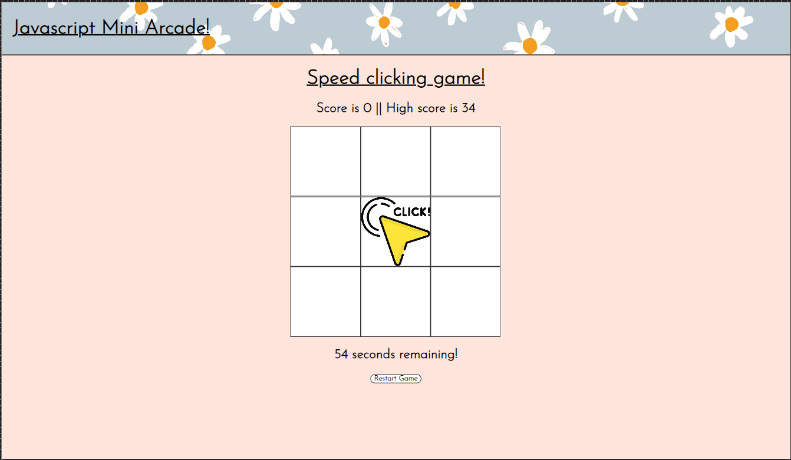
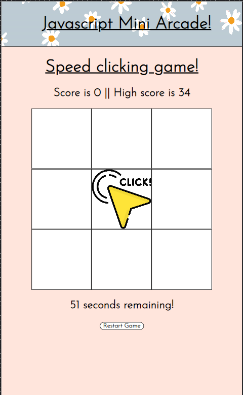
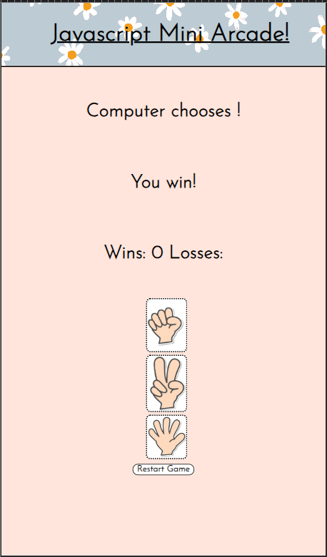
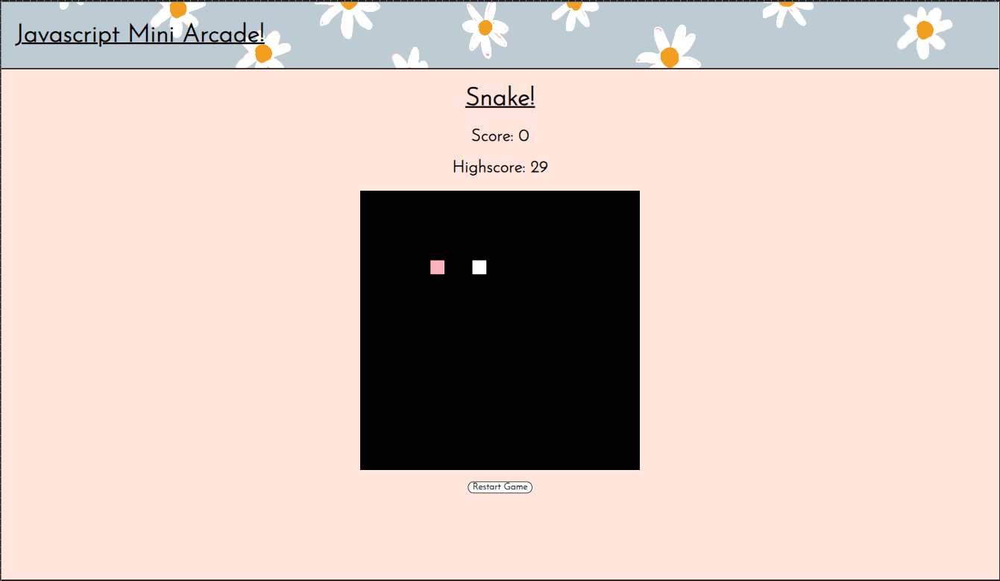
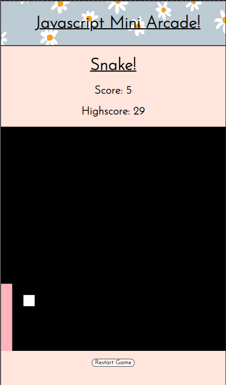
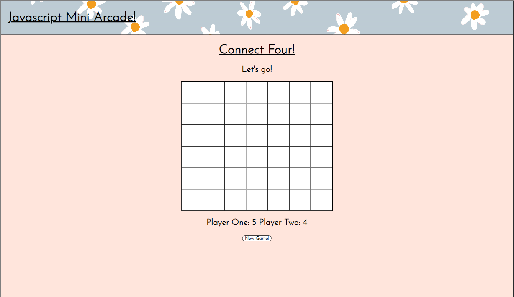
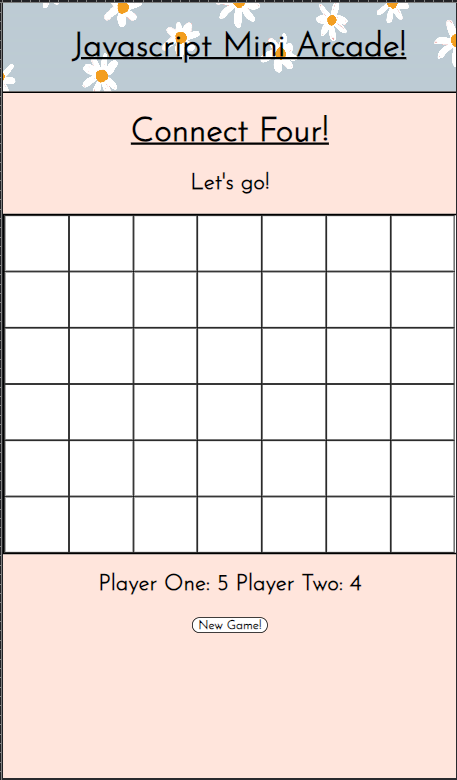

# JavaScript Mini-Arcade!

This JavaScript mini-arcade is a simple website that contains four games for the user to choose from to play. It is aimed at at an individual or individuals of any age. It contains games where the user plays by himself, plays against the computer, and a game to test two players against each other. It aims to get users to return by storing the scores and data. 

There are four games to choose from which could be either well-known, simple games like rock, paper, scissors, or classic computer games like Snake. For two players, there is a version of Connect Four where a users can take turns to try beat each other before starting a new game. Finally, there is an electronic version of the arcade game whack-a-mole which is turned into a hand-eye co-ordination game called Speed Click Test.

## Table of Contents
- Designer Goals
- Design
  - Colour Scheme
  - Fonts
  - Layout
  - Wireframes
- Features
  - Header
  - Homepage
  - Game Selection Area
  - Speed Click Test
  - Rock, Paper, Scissors
  - Snake
  - Connect Four
  - Features To Be Explored/Implemented
- Testing
  - Validator Testing
    - HTML
    - CSS
    - JavaScript
    - Accessibility
  - Browser Testing
  - Device Testing
  - Bugs
    - Fixed Bugs
    - Unfixed Bugs
- Used Technologies
  - Languages
  - Frameworks, libraries, programs used
- Deployment
- Cloning
- Credits
  - Content
  - Media
  - Resources Used
- Acknowledgements 

## Designers Goals
- I wanted to to design and deploy a neat, simple and unfussy website which would be navigable for any user of any demographic.
- I wanted to provide a small collection of simple games to users who want to challenge themselves once, twice or a few times. These games should be familiar to most people in one form or another. I wanted there to be little to no learning curve. 
- I wanted to utilize code I have written from teaching myself and from tutorials that I have learned from since I began my coding journey.
- I wanted to colour and styling to be appealing and subtle with design to be unobtrusive. 
- I wanted to give the user the option about what type of game and challenge they would like - against someone else, against the computer, or against themselves by trying to beat their previous score. 

## Design
### Colour Scheme

 - Colour palette from [Pastel Colour Palette](https://www.color-hex.com/color-palette/5361)

 - The colour scheme was always going to be a pastel palette. For me, pastel colours are calming. They have less contrast and brightness so what they lack in vibrance they make up for in playfulness. They are versatile and visually appealing. 
 - Pastel colours have a retro aesthetic that was common in arcades in the middle of last century. I used them here to try to recreate that arcade vibe. Pastel colours have also become trendy again in the recent decade so they are current and modern. 
 - The pastel palette is generally soothing on the eyes - and this should be effective for a website like JavaScript Mini-Arcade where the games are fairly rudimentary in design. The colour scheme needed to be unobtrusive to allow for a greater emphasis of the content. 

### Fonts

- Imported from Google Fonts, Josefin Sans is the font used throughout the entire website. It has been weighted differently according to whether it is used as a header, title or paragraph. The website has minimal text and so the website needed an elegant, easy to read font. 
- I found Josefin Sans to be elegant and versatile so it suited this project. It is easy to read so it makes a smooth reading experience. It is distinctive without being cartoonish.
- Sans Serif serves as a back-up if there is no access to [Google Fonts](https://fonts.google.com/).

### Layout 

The website has a homepage and four other pages each containing a game. 

- A homepage with a header and body element containing four div elements with four links.
- Each link takes you to a separate html page dedicated to each game. 
- Like the homepage, the game pages contain the same header and body element containing the games. 

### Wireframes

All designed with Balsamiq.

Homepage Wireframe

Game Page Wireframe

Mobile Wireframe

## Features and Functionality

### Home Page

The home page of this website is fairly simple. It contains a header and body with four div elements organised into one parent div. For tablet and mobile viewing, the CSS "display: flex" and "flex: flex-wrap" style property allows the four div elements to collapse vertically. Each of the four div elements is a link to a separate html page. The header element contains a link on the left-hand side that links back to the home page.

Desktop Home Page Screenshot

Mobile Home Page Screenshot

### Speed Clicking Game Page

The first html page is the speed clicking game. The header element remains consistent throughout the website linking us directly to the home page. The body element has a header element that serves as a title. This is followed by two div elements. The first div contains two more div elements containing a current score and a high score updated with span elements. The game itself consists of nine div elements contained within a parent div each with a class of square and unique id of one to nine. Beneath the game, is a header with a timed countdown. Finally, a button will reset and game by reloading the page. For mobile devices, the text centres for the entire page - including the header - and the width of game takes up the entire screen. 

Desktop Speed Clicking Game Screenshot

Mobile Speed Clicking Game Screenshot

### Rock, Paper, Scissor Page

The second html page is the second game - rock, paper, scissors. The header carries over while the body contains two div elements and a button beneath them. The first div contains three div elements horizontally aligned showing the computers choice, the winner and the scoreboard with span elements. The second div contains the main body of the div. Aligned vertically, three div elements contains clickable images to choose you choice of rock, paper or scissors. At the bottom again is a button to reload the page. The horizontal alignment of the div elements collapses vertically for media queries for mobile and tablet viewing. The size slightly reduces also. 

Rock, Paper, Scissors Desktop Screenshot

 Rock, Paper, Scissors Mobile Screenshot

### Snake Page

The third html page is the game Snake. While the header remains the same, the body element is simply a header element containing the title of the game with a div and canvas element beneath it. The div element contains two more div elements with a high score and current score updated with a span element. The canvas tag has an id of board and is filled in with JavaScript. The script will fill it black and place the games parts. Beneath the canvas element is a button to reload the game and the page. For media queries, the canvas will fill to 100% of the width for mobile viewing and the text will align centrally. 

Snake Desktop Screenshot

Snake Mobile Desktop

### Connect Four Page

The connect four page is the fourth and final html page. It contains a header element with a title and another beneath it with a span to update who the current player is. The game itself contains 49 div elements contained within a parent div. The game is styled in such a way that the first 42 div elements fit neatly with a border into the parent div making a six by seven grid. These elements have a class of .taken. Nine div elements overflow the parent div. These elements have a class of .nottaken. Beneath the main game is a header element with two spans contained within to show the current scoreboard. Finally, there is a button to reload the game and the page. 

Connect Four Desktop Screenshot

Connect Four Mobile Screenshot

### Features Left to Implement 

There are many things which come to mind when considering what I would like to add to this project:

- A fifth html page containing scoreboards. Rather than having the high score presented in a header element or a div element on the game page, I would like to have a fifth html page with score boards neatly arranged for each game.

- The Snake game needs to be modified to increase the Snakes speed incrementally to increase difficulty. 
  
- The restart game button should solely reload the game and the DOM.

- The click game should have a start button. When the DOM loads the game begins immediately. This is frustrating causing a negative user experience.

- After learning how to use the canvas element for the Snake game, I believe both the Click Game and Connect Four would be better if they were developed using the canvas element. 

- I would like to make the game more immersive by adding sounds and music to some of the games. I would like to add more to the styling the make the game generally more appealing and interactive. I would like to add more simple animations and utilize the :hover CSS selector more often.

## Testing

### Validator Testing

#### HTML

Here are four image links providing screenshots of the HTML validation for each of the five html documents.

Home Page HTML Validation

Click Game HTML Validation

Rock, Paper, Scissor HTML Validation

Snake HTML Validation

Connect Four HTML Validation

#### CSS 

Here is a screenshot of the CSS Validation:

CSS Validation

#### JavaScript 

The four game HTML pages each have a separate JavaScript file. Here are screenshots of the results from JS validation from JSHint:

Click Game JavaScript Validation

Rock, Paper, Scissors JavaScript Validation

Snake JavaScript Validation

Connect Four JavaScript Validation

### Accessibility

- Desktop Lighthouse Score 

- Mobile Lighthouse Score

### Game Testing 

### Browser Testing

### Device Testing 

### Bugs

- The snake game contains two bugs. Firstly, when the Snake crashes into the wall, it should be game over as soon as the snake hits the wall. Sometimes, it takes for part of the body - i.e the snake array - to go into the wall for the game to be over. Secondly, in the testing phase, the game would abruptly end for no discernible reason. More testing needs to be done to figure out the reason the game would abruptly produce a "game over" alert.
  
- The Click Game contains a bug where the game will end but the "Click" image will continue to pop up on random div elements. Despite the timer counting down and score tallied, the "Click" image will not stop until the restart button is set. I know I have to use clear interval but the problem persists. 

- Connect Four has a bug with the scoring and localStorage property I only noticed during testing. When the DOM loads, the values in local storage will be added to span where the scores for player one and player two should be i.e update high score. Also, when the game finishes, the point is added to the local storage. The bug is that the current score does not increase incrementally for either player one or player two. This means the high score is updated from local storage however the previous score is replaced rather that been added to. Also, when the game ends, rather than resetting, we can still add more div elements into the squares. This is okay, in my opinion, as in real life Connect Four more disks can be added despite the game having ended. The problem is that the score will increment then erratically when the game is reset. 

## Technologies Used
 
### Languages

- HTML
- CSS
- JavaScript
  
### Frameworks, Libraries and Programs

- [Am I responsive?](https://ui.dev/amiresponsive) was used to verify responsiveness of website of different devices.
- [Balsamiq](https://balsamiq.com/) was used to generate Wireframe images.
- [Chrome Developer Tools](https://developer.chrome.com/docs/devtools/) was used in the entire development process equally for HTML, CSS and JavaScript.
- [FontAwesome](https://fontawesome.com/) was used for icons in information bar.
- [GitHub](https://github.com) was used for version control and hosting. 
- [Google Fonts](https://fonts.google.com/) was used to import and alter fonts on the website. 
- [W3C](https://www.w3.org) was used for HTML and CSS validation.
- [JSHint](https://jshint.com/) was used for JavaScript validation.
- [Colour-Hex](https://www.color-hex.com/) was used to get a colour palette.
- [Creazilla](https://creazilla.com/) for PNG Clip Art used for Rock, Paper, Scissor game. 
  
## Deployment 

## Cloning

## Credits

### Content

The brainstorming process that began in the lead up to starting my project, I was spending time watching tutorials on how to make quizzes and games with JavaScript. I was considering somehow utilizing Google Charts for my project. I generally understood the process involved in some of the tutorials - like Connect Four. While in other tutorials - like a Pong game - I was left confused. Despite this, I learned quite a lot watching these tutorials especially regarding canvas elements, JavaScript switch elements, the setInterval and clearInterval functions, localStorage functions and more. I decided to integrate some of the code I had written while watching tutorials into a website that offered multiple games. This way code I had written would not go to waste and I could present it alongside my own code.

### Resourced Content and Media

- W3Schools constantly offered me solutions, definitions and runnable examples when I needed information or ran into a problem. 
- Stack Overflow.
- The Snake game was taken from this tutorial which thought me how to use the canvas element. I integrated it into my own website: [How to code snake game in JavaScript](https://www.youtube.com/watch?v=baBq5GAL0_U).
- I had written a very basic rock, paper, scissor game but because I wanted to use images and the onClick function to determine the user choice, the localStorage function to to getItem and setItem to update the scores in the DOM, I used code from freeCodeCamp.com that used a Switch statement to determine the winner and calls three separate new functions - win(), lose(), draw() - which made it easier to update the local storage and the DOM with .innerHTML. At the end of rockpaperscissors.js I left my own code commented out. I used this tutorial: [JavaScript, HTML, CSS - Rock Paper Scissors Game](https://www.youtube.com/watch?v=jaVNP3nIAv0).
- For the Connect Four and Click Game, I used the methods from this video in developing the games: [Learn JavaScript by Building 7 Games ](https://www.youtube.com/watch?v=ec8vSKJuZTk&t=5246s).
- For the Connect Four, I copied the list of winning arrays and used it's method of looping through the squares listening for a click so I could add a circular background image to small div. I also used the tutorials method of looping through the winning arrays to see if they equal to one chosen by either player one or player two. 
- For the Click Game, I used the setInterval function from the tutorial on Whack-A-Mole for my own code to make the image appear on a random div every minute  or so. 
- I used these two tutorials to learn how to used localStorage with JavaScript: [Storing Objects with Local Storage in JavaScript](https://www.youtube.com/watch?v=AUOzvFzdIk4) and [An Introduction to Local Storage with JavaScript](https://www.youtube.com/watch?v=T9GWHFDcELQ&t=672s).
- For writing this readme.md I used this explainer: [Markdown Cheat Sheet](https://www.markdownguide.org/cheat-sheet/). 
- I used Creazilla to find PNG images for the Rock, Paper, Scissor game: [Creazilla](https://creazilla.com/nodes/36999-hands-are-showing-rock-paper-scissors-icons-clipart).
- <a href="https://www.freepik.com/free-vector/flower-background-desktop-wallpaper-cute-vector_18247662.htm#query=pastel%20pattern&position=3&from_view=keyword&track=ais">Image by rawpixel.com</a> on Freepik

## Acknowledgements

I would like to thank Antonio, my mentor, for his support and also the entire Slack community especially the #peer-code-review channel. 