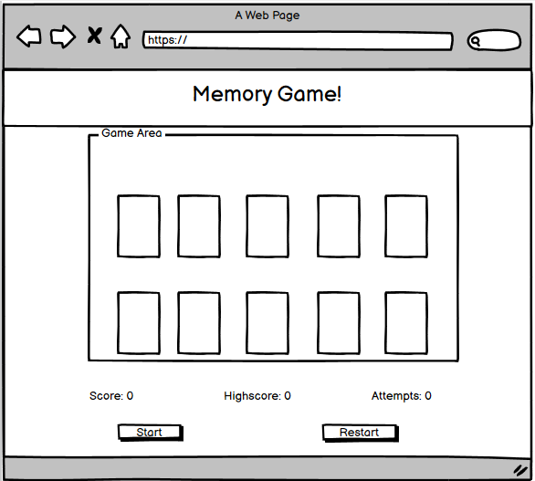
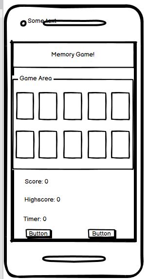
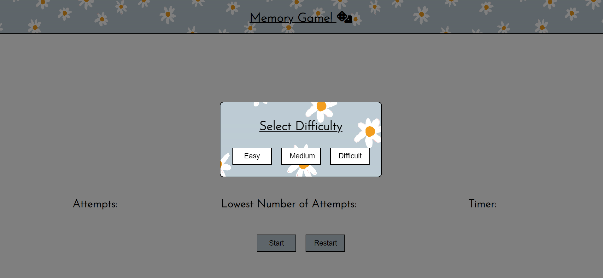
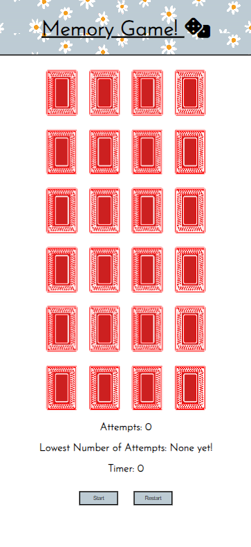
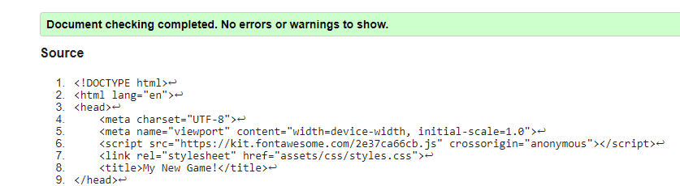
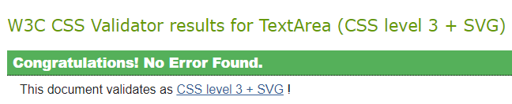
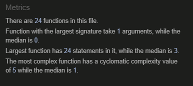

# Memory Game!

## Table of Contents
- Designer Goals
- Design
  - Colour Scheme
  - Fonts
  - Layout
  - Wireframes
- Features
  - Header
  - Homepage
  - Features To Be Explored/Implemented
- Testing
  - Validator Testing
    - HTML
    - CSS
    - JavaScript
    - Accessibility
  - Browser Testing
  - Device Testing
  - Bugs
    - Fixed Bugs
    - Unfixed Bugs
- Used Technologies
  - Languages
  - Frameworks, libraries, programs used
- Deployment
- Cloning
- Credits
  - Content
  - Media
  - Resources Used
- Acknowledgements 

## Designers Goals

This webpage is a familiar card matching game that will test a players memory. The goal is to match all the cards with the fewest attempts possible. The game itself is a grid of cards which forms a board. Each section of a grid contains a card lying face-down. By clicking on each card with the cursor the card will flip. The objective is to find all matching pairs by flipping two at a time. If the two cards match they will remain face-up, if not they will flip back down. The game can be restarted at any stage.

The game comes with three difficulty levels. When the website loads, a modal is generated to choose difficulty levels. Upon choosing the board is generated corresponding the with difficulty chosen. While the game is timed, the goal of the game is to match all the cards with the lowest amount of attempts. This value is stored in local storage and is accessed when the game loads. The goal is to beat this number.

## Design
### Fonts

- Imported from Google Fonts, Josefin Sans is the font used throughout the entire website. It has been weighted differently according to whether it is used as a header, title or paragraph. The website has minimal text and so the website needed an elegant, easy to read font. I found Josefin Sans to be elegant and versatile so it suited this project. It is easy to read so it makes a smooth reading experience. It is distinctive without being cartoonish. Sans Serif serves as a back-up if there is no access to [Google Fonts](https://fonts.google.com/).

### Layout 

The website with a header and body element. The body element features a grid of divs to represent each card. Each card has a "front" and "back" div. The game board is generated through JavaScript with event listeners attached to each card. Beneath the game board is another div containing divisions for the timer, number of attempts and stored number of attempts. Upon loading, the player is met with a modal to determine difficulty. The design is responsive and scales for smaller devices. 

### Wireframes

All designed with Balsamiq.

Desktop Game Page Wireframe

Mobile Game Page Wireframe

## Features and Functionality

### Game Page

Game Page Screenshot Desktop

Game Page Screenshot Mobile

### Features Left to Implement 

- For anyone with an understanding of HTML and CSS the game will be easy to cheat with because the card numbers are easily available to view with Dev Tools.

- With more images added to the deck_of_cards directory the player could pick the suit of cards they wanted to play with - Hearts is the only option available for this game. 

- A score board page with values stored in Local Storage. 

## Testing

### Validator Testing

#### HTML

Here is an image link providing a screenshot of the HTML validation for the webpage.

Game Page HTML Validation

#### CSS 

Here is an image link providing a screenshot of the CSS validation for the webpage.

Game Page CSS Validation

#### JavaScript

Here is an image link providing a screenshot of the JavaScript validation for the webpage.

Game Page JavaScript Validation

### Accessibility

#### Desktop Lighthouse Score 
  
Here are screenshots of the performance of the desktop versions of the project:
  

Game Page Desktop Lighthouse Performance

#### Mobile Lighthouse Score

The performance scores are greatly reduced when viewed on a mobile. The images that sufficed for desktop viewing do not work for mobile viewing. 

Home Page Mobile Lighthouse Performance

### Game Testing

### Browser Testing

### Device Testing

### Bugs

### Fixed bugs

## Technologies Used
 
### Languages

- HTML
- CSS
- JavaScript
  
### Frameworks, Libraries and Programs

- [Am I responsive?](https://ui.dev/amiresponsive) was used to verify responsiveness of website of different devices.
- [Balsamiq](https://balsamiq.com/) was used to generate Wireframe images.
- [Chrome Developer Tools](https://developer.chrome.com/docs/devtools/) was used in the entire development process equally for HTML, CSS and JavaScript.
- [FontAwesome](https://fontawesome.com/) was used for icons in information bar.
- [GitHub](https://github.com) was used for version control and hosting. 
- [Google Fonts](https://fonts.google.com/) was used to import and alter fonts on the website. 
- [W3C](https://www.w3.org) was used for HTML and CSS validation.
- [JSHint](https://jshint.com/) was used for JavaScript validation.
- [Colour-Hex](https://www.color-hex.com/) was used to get a colour palette.
- [Creazilla](https://creazilla.com/) for PNG Clip Art used for *Rock, Paper, Scissor* game. 
  
## Deployment 

The site was deployed using GitHub pages. The steps to deploy using GitHub are:

- Go to the repository on GitHub.com
- Select 'Settings' near the top of the page
- Select 'Pages' from the menu bar on the left of the page
- Under 'Source' select the 'Branch' dropdown menu and select the main branch.
- Once selected, click 'Save'.
- Deployment will then be confirmed by a message confirming this followed by a link

The live link to my own project - JavaScript Mini-Arcade - is here: https://chrisryan91.github.io/JavaScript-Mini-Arcade/

## Cloning

The repository to this website is here: https://github.com/chrisryan91/JavaScript-Mini-Arcade. To clone: 

- Under 'Code', choose a preferred cloning option from HTTPS, SSH or GitHub CLI. 
- Copy the link provided.
- Open Terminal, and change the current working directory to the desired location of the cloned repository.
- Type 'git clone' and then paste the URL copied from GitHub earlier. 
- Type 'Enter' to create a local clone.
- 
## Credits

### Content

I needed to make a game from scratch. I wanted to challenge myself and use the skills I had already learned on the course to build something from the ground up. I didn't want to make something too unique or abstract because if I did run into trouble - which I did - then I could find solutions. I wanted to utilize some of the things I have learned like local storage functions and template literals. Ultimately however I wanted to make something uncomplicated and user-friendly. 

A Memory Game became my choice because it is familiar to everyone including myself yet was challenging enough to pique my interest. I had a few ideas on how to go about but as I built it from the ground-up there was many challenges in the form of bugs which I have mentioned above. I wanted too to be able to expand on the game with difficulty levels.

### Resourced Content and Media

- W3Schools constantly offered me solutions, definitions and runnable examples when I needed information or ran into a problem. 
- I used these two tutorials to learn how to used localStorage with JavaScript: [Storing Objects with Local Storage in JavaScript](https://www.youtube.com/watch?v=AUOzvFzdIk4) and [An Introduction to Local Storage with JavaScript](https://www.youtube.com/watch?v=T9GWHFDcELQ&t=672s).
- For writing this readme.md I used this explainer: [Markdown Cheat Sheet](https://www.markdownguide.org/cheat-sheet/). 
- <a href="https://www.freepik.com/free-vector/flower-background-desktop-wallpaper-cute-vector_18247662.htm#query=pastel%20pattern&position=3&from_view=keyword&track=ais">Image by rawpixel.com</a> on Freepik

## Acknowledgements

