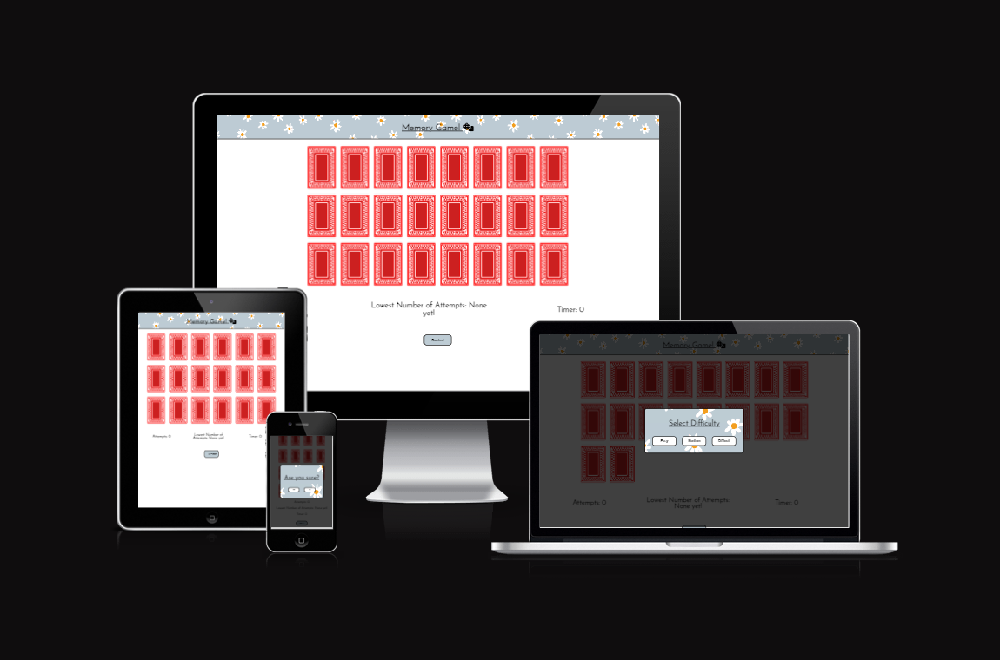

# My new game!

## Table of Contents
- Designer Goals
- Design
  - Colour Scheme
  - Fonts
  - Layout
  - Wireframes
- Features
  - Header
  - Homepage
  - Game Selection Area
  - Speed Click Test
  - Rock, Paper, Scissors
  - Snake
  - Connect Four
  - Features To Be Explored/Implemented
- Testing
  - Validator Testing
    - HTML
    - CSS
    - JavaScript
    - Accessibility
  - Browser Testing
  - Device Testing
  - Bugs
    - Fixed Bugs
    - Unfixed Bugs
- Used Technologies
  - Languages
  - Frameworks, libraries, programs used
- Deployment
- Cloning
- Credits
  - Content
  - Media
  - Resources Used
- Acknowledgements 

## Designers Goals

## Design
### Colour Scheme

 - Colour palette from [Pastel Colour Palette](https://www.color-hex.com/color-palette/5361)

 - The colour scheme was always going to be a pastel palette. For me, pastel colours are calming. They have less contrast and brightness so what they lack in vibrance they make up for in playfulness. They are versatile and visually appealing. 
 - Pastel colours have a retro aesthetic that was common in arcades in the middle of last century. I used them here to try to recreate that arcade vibe. Pastel colours have also become trendy again in the recent decade so they are current and modern. 
 - The pastel palette is generally soothing on the eyes - and this should be effective for a website like JavaScript Mini-Arcade where the games are fairly rudimentary in design. The colour scheme needed to be unobtrusive to allow for a greater emphasis of the content. 

### Fonts

- Imported from Google Fonts, Josefin Sans is the font used throughout the entire website. It has been weighted differently according to whether it is used as a header, title or paragraph. The website has minimal text and so the website needed an elegant, easy to read font. 
- I found Josefin Sans to be elegant and versatile so it suited this project. It is easy to read so it makes a smooth reading experience. It is distinctive without being cartoonish.
- Sans Serif serves as a back-up if there is no access to [Google Fonts](https://fonts.google.com/).

### Layout 

The website has a Homepage and four other pages each containing a game. 

### Wireframes

All designed with Balsamiq.

Homepage Wireframe

Game Page Wireframe

Mobile Wireframe

## Features and Functionality

### Game Page

Page Screenshot

Page Screenshot

### Features Left to Implement 

## Testing

### Validator Testing

#### HTML

Here are four image links providing screenshots of the HTML validation for each of the five html documents.

Home Page HTML Validation

#### CSS 

#### JavaScript 

### Accessibility

#### Desktop Lighthouse Score 
  
Here are screenshots of the performance of the desktop versions of the project:
  

Home Page Desktop Lighthouse Performance

#### Mobile Lighthouse Score

The performance scores are greatly reduced when viewed on a mobile. The images that sufficed for desktop viewing do not work for mobile viewing. 

Home Page Mobile Lighthouse Performance

### Game Testing

The games were tested by myself, friends and family. The bugs noticed were noticed by them. Also, the features left the implement section was contributed to by other people than myself. 
### Browser Testing

The website was tested on Google Chrome, Microsoft Edge and Safari on desktop and mobile.

### Device Testing 

The website was consistently tested for responsiveness using Chrome Developer tools. Once deployed, it was again tested as a Desktop, iPad, iPhone and a host of Samsung Galaxy varieties to test again. There were a few issues with responsiveness but it remains functioning above 300px width.

### Bugs

### Fixed bugs
## Technologies Used
 
### Languages

- HTML
- CSS
- JavaScript
  
### Frameworks, Libraries and Programs

- [Am I responsive?](https://ui.dev/amiresponsive) was used to verify responsiveness of website of different devices.
- [Balsamiq](https://balsamiq.com/) was used to generate Wireframe images.
- [Chrome Developer Tools](https://developer.chrome.com/docs/devtools/) was used in the entire development process equally for HTML, CSS and JavaScript.
- [FontAwesome](https://fontawesome.com/) was used for icons in information bar.
- [GitHub](https://github.com) was used for version control and hosting. 
- [Google Fonts](https://fonts.google.com/) was used to import and alter fonts on the website. 
- [W3C](https://www.w3.org) was used for HTML and CSS validation.
- [JSHint](https://jshint.com/) was used for JavaScript validation.
- [Colour-Hex](https://www.color-hex.com/) was used to get a colour palette.
- [Creazilla](https://creazilla.com/) for PNG Clip Art used for *Rock, Paper, Scissor* game. 
  
## Deployment 

The site was deployed using GitHub pages. The steps to deploy using GitHub are:

- Go to the repository on GitHub.com
- Select 'Settings' near the top of the page
- Select 'Pages' from the menu bar on the left of the page
- Under 'Source' select the 'Branch' dropdown menu and select the main branch.
- Once selected, click 'Save'.
- Deployment will then be confirmed by a message confirming this followed by a link

The live link to my own project - JavaScript Mini-Arcade - is here: https://chrisryan91.github.io/JavaScript-Mini-Arcade/

## Cloning

The repository to this website is here: https://github.com/chrisryan91/JavaScript-Mini-Arcade. To clone: 

- Under 'Code', choose a preferred cloning option from HTTPS, SSH or GitHub CLI. 
- Copy the link provided.
- Open Terminal, and change the current working directory to the desired location of the cloned repository.
- Type 'git clone' and then paste the URL copied from GitHub earlier. 
- Type 'Enter' to create a local clone.
## Credits

### Content

The brainstorming process that began in the lead up to starting my project, I was spending time watching tutorials on how to make quizzes and games with JavaScript. I was considering somehow utilizing Google Charts for my project. I generally understood the process involved in some of the tutorials - like *Connect Four*. While in other tutorials - like a Pong game - I was left confused. Despite this, I learned quite a lot watching these tutorials especially regarding canvas elements, JavaScript switch elements, the setInterval and clearInterval functions, localStorage functions and more. I decided to integrate some of the code I had written while watching tutorials into a website that offered multiple games. This way code I had written would not go to waste and I could present it alongside my own code.

### Resourced Content and Media

- W3Schools constantly offered me solutions, definitions and runnable examples when I needed information or ran into a problem. 
- I used these two tutorials to learn how to used localStorage with JavaScript: [Storing Objects with Local Storage in JavaScript](https://www.youtube.com/watch?v=AUOzvFzdIk4) and [An Introduction to Local Storage with JavaScript](https://www.youtube.com/watch?v=T9GWHFDcELQ&t=672s).
- For writing this readme.md I used this explainer: [Markdown Cheat Sheet](https://www.markdownguide.org/cheat-sheet/). 
- <a href="https://www.freepik.com/free-vector/flower-background-desktop-wallpaper-cute-vector_18247662.htm#query=pastel%20pattern&position=3&from_view=keyword&track=ais">Image by rawpixel.com</a> on Freepik

## Acknowledgements

I would like to thank Antonio, my mentor, for his support and also the entire Slack community especially the #peer-code-review channel. 