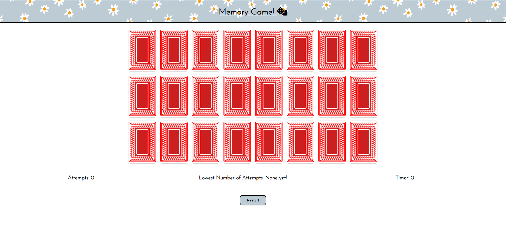
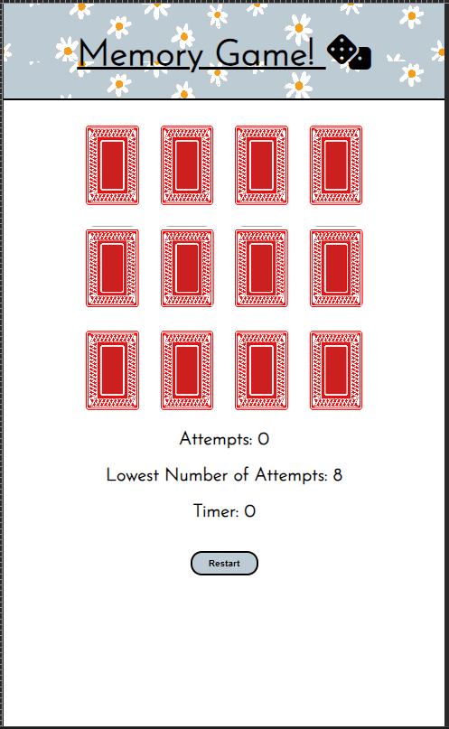
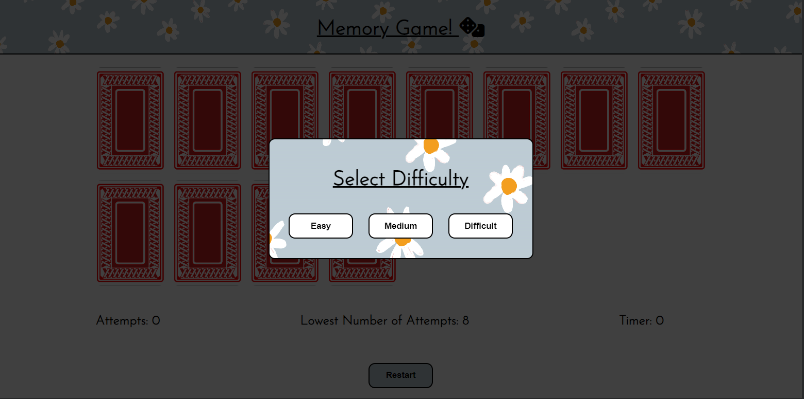
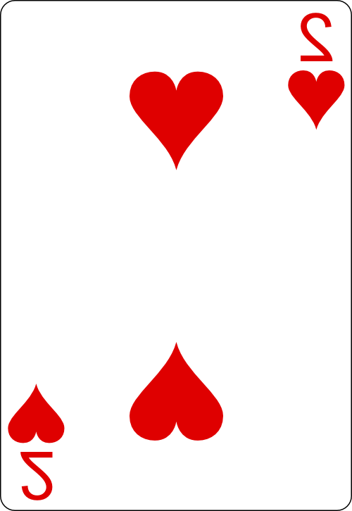

# Memory Game!

Welcome to the Memory Card Game, a simple but challenging game for players of all ages and abilities. This game is designed to test the players short-term memory skills. The game offers different difficulty levels, allowing you to tailor the challenge to your preference. Whether you're a casual player looking for a quick brain exercise or a memory master seeking a new challenge, the Memory Card Game is a simple game of flipping cards, racing against the clock and trying to get the lowest number of attempts.

## Table of Contents
- [Designer Goals](https://github.com/chrisryan91/Memory-Game#designers-goals)
- [Design](https://github.com/chrisryan91/Memory-Game#design)
  - Colour Scheme
  - Fonts
  - Layout
  - Wireframes
- [Features and Functionality](https://github.com/chrisryan91/Memory-Game#features-and-functionality)
  - Header
  - Homepage
  - Features to be implemented
- [Testing](https://github.com/chrisryan91/Memory-Game#testing)
  - Validator Testing
    - HTML
    - CSS
    - JavaScript
    - Accessibility
  - Browser Testing
  - Device Testing
  - Bugs
    - Fixed Bugs
    - Unfixed Bugs
- [Technology Used](https://github.com/chrisryan91/Memory-Game#technologies-used)
  - Languages
  - Frameworks, libraries, programs used
- [Deployment](https://github.com/chrisryan91/Memory-Game#deployment)
- [Cloning](https://github.com/chrisryan91/Memory-Game#cloning)
- [Credits](https://github.com/chrisryan91/Memory-Game#credits)
  - Content
  - Media
  - Resources Used
- [Acknowledgements](https://github.com/chrisryan91/Memory-Game#acknowledgements)

## Designers Goals

This webpage is a familiar card matching game that will test a players memory. The goal is to match all the cards with the fewest attempts possible. The game itself is a grid of cards which forms a board. Each section of a grid contains a card lying face-down. By clicking on each card with the cursor the card will flip. The objective is to find all matching pairs by flipping two at a time. If the two cards match they will remain face-up, if not they will flip back down. The game can be restarted at any stage.

The game comes with three difficulty levels. When the website loads, a modal is generated to choose difficulty levels. Upon choosing the board is generated corresponding the with difficulty chosen. While the game is timed, the goal of the game is to match all the cards with the lowest amount of attempts. This value is stored in local storage and is accessed when the game loads. The goal is to beat this number.

## Design
### Fonts

Imported from Google Fonts, Josefin Sans is the font used throughout the entire website. It has been weighted differently according to whether it is used as a header, title or paragraph. The website has minimal text and so the website needed an elegant, easy to read font. I found Josefin Sans to be elegant and versatile so it suited this project. It is easy to read so it makes a smooth reading experience. It is distinctive without being cartoonish. Sans Serif serves as a back-up if there is no access to [Google Fonts](https://fonts.google.com/).

### Layout 

The website with a header and body element. The body element features a grid of divs to represent each card. Each card has a "front" and "back" div. The game board is generated through JavaScript with event listeners attached to each card. Beneath the game board is another div containing divisions for the timer, number of attempts and stored number of attempts. Upon loading, the player is met with a modal to determine difficulty. The design is responsive and scales for smaller devices. 

### Wireframes

All designed with Balsamiq.

Desktop Game Page Wireframe

Mobile Game Page Wireframe

## Features and Functionality

### Game Page

Game Page Screenshot Desktop

Game Page Screenshot Mobile

Modal One Screenshot

Modal Two Screenshot

### Features Left to Implement 

1. For anyone with an understanding of HTML and CSS the game will be easy to cheat with because the card numbers are easily available to view with Dev Tools.

2. With more images added to the deck_of_cards directory the player could pick the suit of cards they wanted to play with - Hearts is the only option available for this game. It is true also for the design of the cards - with multiple designs in the directory users could choose whichever cards they would like.

3. With more decks of cards, the difficulty of the game could be increased. With a whole deck rather than suit, there could potentially be a massive board onscreen with 104 cards to pick 52 matches.

4. I do not think Lowest Number of Attempts is the greatest was to determine a "high" score. In the case for this game, a "high" score is actually a lower score. I do not think that storing the lowest value for attempts is the best way to keep track of a users progress in the game. The timer function needs to be integrated into the "high" score. Some along the lines of: x attempts in y seconds may be best to determine a high score.

5. With a proper scoring system, a leader board could be generated to determine whose score is best. This would mean developing the website so users could potentially log-in with a username and password.

## Testing

### Validator Testing

#### HTML

Here is an image link providing a screenshot of the HTML validation for the webpage. No errors were returned when passed through the W3C Markup Validator.

Game Page HTML Validation

#### CSS 

Here is an image link providing a screenshot of the CSS validation for the webpage. No errors were returned when passed through the W3C CSS Markup Validator.

Game Page CSS Validation

#### JavaScript

Here is an image link providing a screenshot of the JavaScript validation for the webpage. No errors or warnings returned when passing through JSHint Validator.

Game Page JavaScript Validation

### Accessibility

#### Desktop Lighthouse Score 
  
The site scores 100% for accessibility on Mobile and Desktop devices.
  

Game Page Desktop Lighthouse Performance

#### Mobile Lighthouse Score

The performance scores are greatly reduced when viewed on a mobile. The images that sufficed for desktop viewing do not work for mobile viewing. 

Home Page Mobile Lighthouse Performance

### Game Testing

The game was testing by myself and friends to ensure it functions correctly. Some bugs were found in this process however they are documented in a separate section below.

- The buttons on the modal work by ensuring that the correct board is generated by choosing the difficulty level.
- The cards flip when clicked and the cursor changes when hovered over.
- The first card and second card are flipped and the board freezes so if another card is clicked, it does not flip.
- The two cards remain flipped if they match.
- When all cards are flipped and all matches found, there is a three second pause before the alert arrives.
- The timer works and stops when all matches are found.
- For each two cards flipped, indicating one attempt, the attempts score increases by one.
- The lowest attempt is correctly added from Local Storage - if no value is found, the text reads, "No Attempts!".
- The local storage property correctly updates with the lowest value for attempts for the specific difficulty.
- When restart is clicked, at any stage during the game, the board resets and the modal appears again.
- The start button also starts the the timer.

### Browser Testing

On desktop, the game was tested on Chrome, Mozilla Firefox and Opera. The game functioned correctly each time. No issues were detected.

### Device Testing

Upon first deployment, I sent the game to friends and family who use different devices. I noticed no issues when I played the game on Chrome and Opera on my phone. I noticed no issues when I played the game on different browsers on my windows computer. The game was also played on IOS and Mac laptops. No issues were reported.

Am I responsive?

### Bugs

There are no known bugs.

### Fixed bugs

#### Issue with card flipping back

The first bug I ran into stumped me for a while. When designing the game first, before I considered using JavaScript to generate the board, I had the grid for the cards in index.html. I had all the functionality working but when card would flip back over, after being clicked, it would not show the back of the card. Instead it showed the front of the card flipped. Like this:

Card flipped

I consulted Reddit and StackOverflow was shown a method to get the card to flip back correctly. It involved injecting html and CSS styling into the index.html with JavaScript using template literals. Links are in the acknowledgement section below.

Using this method also made it handier for me to let the user choose their own difficulty level. By only generating the board after the users choice was inputted, it allowed me to keep the entire game on one html page. 

#### Bugs when updating local storage

I struggled for a while to update the Index.html with the Lowest Score from the Local Storage. This was because a "high score" for the game was actually the lowest score. I needed to compare the score for the current game with the value in local storage but I wasn't sure what to do if there was no value in local storage, or the value was a string. I came up with this solution:

`const storedScore = parseInt(localStorage.getItem(storageKey)) || Infinity;`

I declared the storeScore variable to be either the value in Local Storage but if that value was a string it would return as infinity. As all all of the scores for my game would be less than infinity practically speaking, I used this method. It will work unless someone played my game and their attempt value was greater than infinity.

#### Second Modal appearing beneath deck of cards

When I decided to implement a second modal when the "restart" button was clicked I wanted to use the same CSS styling as the first modal. This would reduce the amount of code I had to write. I subsequently implemented the function to call a new modal when I clicked restart. However, the modal did not appear on top of all the other content and the deck of cards appeared above it. 

I searched Google on a solution and I learned about the z-index to specify stack order of elements on a page. I set CSS styling for the models to 1000. This solved my problem. 

## Technologies Used
 
### Languages

- HTML
- CSS
- JavaScript
  
### Frameworks, Libraries and Programs

- [Am I responsive?](https://ui.dev/amiresponsive) was used to verify responsiveness of website of different devices.
- [Balsamiq](https://balsamiq.com/) was used to generate Wireframe images.
- [Chrome Developer Tools](https://developer.chrome.com/docs/devtools/) was used in the entire development process equally for HTML, CSS and JavaScript.
- [FontAwesome](https://fontawesome.com/) was used for icons in information bar.
- [GitHub](https://github.com) was used for version control and hosting. 
- [Google Fonts](https://fonts.google.com/) was used to import and alter fonts on the website. 
- [W3C](https://www.w3.org) was used for HTML and CSS validation.
- [JSHint](https://jshint.com/) was used for JavaScript validation.
  
## Deployment 

The site was deployed using GitHub pages. The steps to deploy using GitHub are:

- Go to the repository on GitHub.com
- Select 'Settings' near the top of the page
- Select 'Pages' from the menu bar on the left of the page
- Under 'Source' select the 'Branch' dropdown menu and select the main branch.
- Once selected, click 'Save'.
- Deployment will then be confirmed by a message confirming this followed by a link

The live link to my own project is here: https://chrisryan91.github.io/Memory-Game/

## Cloning

The repository to this website is here: https://github.com/chrisryan91/Memory-Game. To clone: 

- Under 'Code', choose a preferred cloning option from HTTPS, SSH or GitHub CLI. 
- Copy the link provided.
- Open Terminal, and change the current working directory to the desired location of the cloned repository.
- Type 'git clone' and then paste the URL copied from GitHub earlier. 
- Type 'Enter' to create a local clone.
  
## Credits

### Content

I needed to make a game from scratch. I wanted to challenge myself and use the skills I had already learned on the course to build something from the ground up. I didn't want to make something too unique or abstract because if I did run into trouble - which I did - then I could find solutions. I wanted to utilize some of the things I have learned like local storage functions and template literals. Ultimately however I wanted to make something uncomplicated and user-friendly. 

A Memory Game became my choice because it is familiar to everyone including myself yet was challenging enough to pique my interest. I had a few ideas on how to go about but as I built it from the ground-up there was many challenges in the form of bugs which I have mentioned above. I wanted too to be able to expand on the game with difficulty levels.

### Resourced Content and Media

1. W3Schools constantly offered me solutions, definitions and runnable examples when I needed information or ran into a problem. 
  
2. I used these two tutorials to learn how to used localStorage with JavaScript: [Storing Objects with Local Storage in JavaScript](https://www.youtube.com/watch?v=AUOzvFzdIk4) and [An Introduction to Local Storage with JavaScript](https://www.youtube.com/watch?v=T9GWHFDcELQ&t=672s).
  
3. W3C schools article on local storage function: [W3 Local Storage](https://www.w3schools.com/jsref/prop_win_localstorage.asp)

4. For writing this readme.md I used this explainer: [Markdown Cheat Sheet](https://www.markdownguide.org/cheat-sheet/).

5. <a href="https://www.freepik.com/free-vector/flower-background-desktop-wallpaper-cute-vector_18247662.htm#query=pastel%20pattern&position=3&from_view=keyword&track=ais">Image by rawpixel.com</a> on Freepik.

6. StackOverFlow was referenced constantly especially these links which provided me a method to inject HTML and CSS with JavaScript:
* ["Memory game not flipping properly"](https://stackoverflow.com/questions/70922279/memory-game-cards-not-flipping-properly)
* ["Memory Card Game "if else" statement not working"](https://stackoverflow.com/questions/63421928/memory-card-game-if-else-statement-not-working-javascript)
* ["why is my memory game not working? i can't flip the cards or make the game start"](https://stackoverflow.com/questions/65954053/why-is-my-memory-game-not-working-i-cant-flip-the-cards-or-make-the-game-start)

1. W3 schools for the Fisher-Yates shuffle and CSS z-index Property - https://www.w3schools.com/js/js_array_sort.asp and https://www.w3schools.com/cssref/pr_pos_z-index.php.

## Acknowledgements
- 

- 

